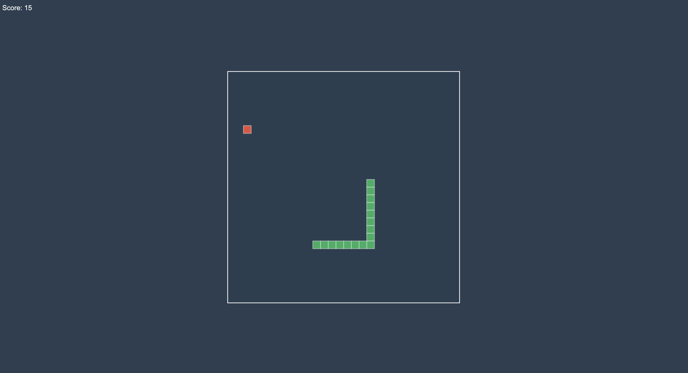

# Simple Snake Game

Welcome to the Simple Snake Game! This project is a basic implementation of the classic snake game, reminiscent of the old mobile games we enjoyed in the past.

## How to Play

1. **Objective**: The goal of the game is to control the snake and eat as much food as possible without colliding with the walls or the snake's own tail.

2. **Controls**:
   - Use the arrow keys (Up, Down, Left, Right) to control the snake's direction.
   - The snake will continuously move in the current direction until you change it.

3. **Scoring**:
   - Each time the snake eats food, it grows longer.
   - The score increases with each food item consumed.

4. **Game Over**:
   - The game ends if the snake collides with the walls or itself.
   - You can restart the game after it's over.

## How to Run

1. Clone the repository: `git clone [repository-url]`.
2. Open `index.html` in your web browser to start the game.

## Demo

To see a live demo, [click here](https://sameermuslim.github.io/snake-game) to play the Simple Snake Game.

## Technologies Used

This game is built using HTML, CSS, and JavaScript for a simple yet nostalgic gaming experience.

## Screenshots

## Contributing

We welcome contributions to make the Simple Snake Game even better! If you'd like to contribute:

1. Fork the repository.
2. Create a new branch: `git checkout -b feature/new-feature`.
3. Make your changes and commit them: `git commit -m 'Add new feature'`.
4. Push to the branch: `git push origin feature/new-feature`.
5. Open a pull request.

Feel free to open issues, suggest enhancements, or discuss ideas. Your input is highly appreciated!

## License

This Snake Game project is licensed under the [MIT License](LICENSE). Enjoy the game!

Thank you for playing the Simple Snake Game!
